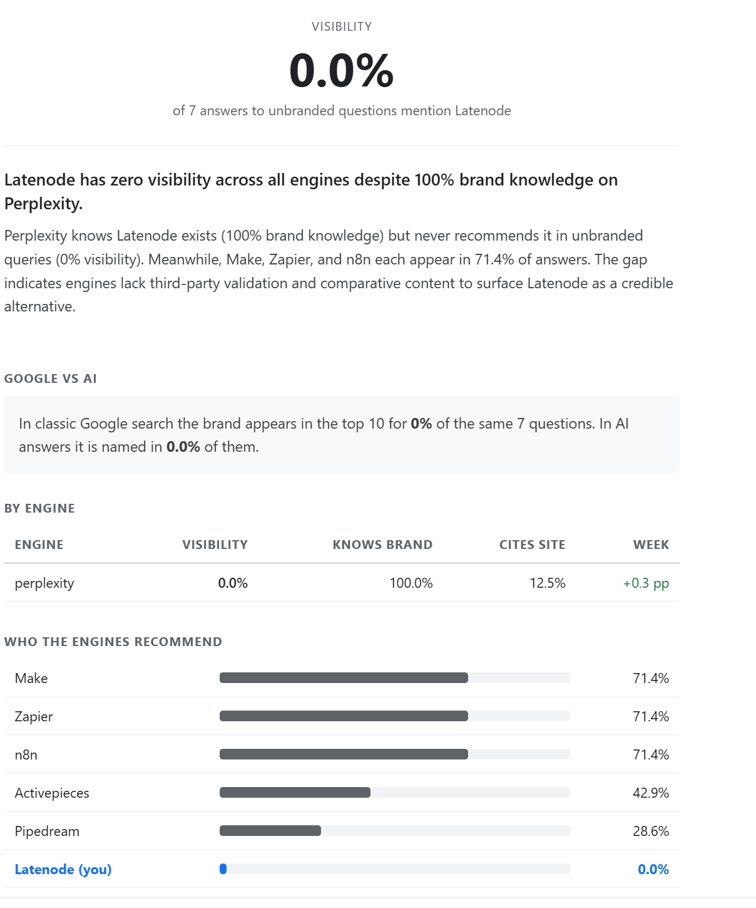
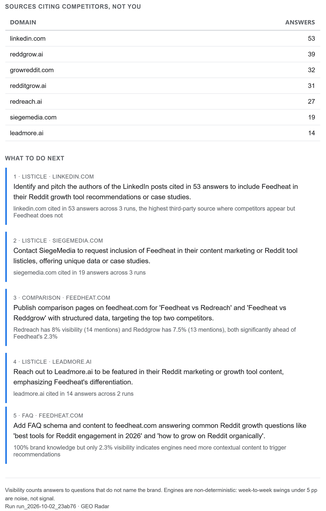
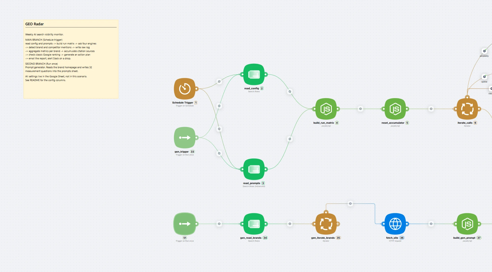

# GEO Radar

Weekly monitor of how often AI search engines name your brand - and who they name instead.

[](./LICENSE)
[](https://latenode.com)
[](#what-it-measures)
[](#running-several-brands)

Every week the scenario asks the same set of questions to Perplexity, ChatGPT, Claude and Gemini, counts how often your brand appears in the answers, compares that to your competitors, and emails a report with a concrete action plan.

---

## The problem

Ask an AI assistant "what are the best tools in my category" and it will name five products. If yours is not among them, you are invisible to a growing share of buyers - and unlike classic search, there is no rank tracker telling you so.

Most brands discover they have a problem only when someone happens to ask.

A typical first measurement looks like this:

```
Brand knowledge   100%   every engine knows the brand when asked directly
Visibility          0%   no engine names it when the buyer does not
Competitors     56-71%   named in most answers to the same questions
```

The brand is known and never recommended. That gap is what this template measures and works on.

---

## What it measures

| Metric | Meaning |
|---|---|
| **Visibility** | Share of answers to unbranded questions that mention the brand. The headline number. |
| **Brand knowledge** | Share of answers to questions that name the brand directly. Expect this near 100%. |
| **Citation rate** | Share of answers where the engine cites the brand's own domain. |
| **Share of voice** | Brand mentions against all brand mentions including competitors. |
| **Competitor board** | Who the engines actually recommend, ranked. |
| **Gap sources** | Third-party domains cited in answers where competitors appear and the brand does not. |
| **Google vs AI** | Where the brand ranks in classic Google for the same questions. |

Visibility and brand knowledge are kept apart on purpose. Mixing one branded question into eight pins every engine at the same number and hides the real difference between them.

---

## What comes out





A weekly email: the headline number, a per-engine table with week-over-week movement, a bar chart of who the engines recommend, the list of sources citing competitors but not you, and four to six actions written against that data.

Actions are grounded in the measurement, not in generic advice:

```
1 · COMMUNITY · dev.to
Publish technical tutorials showing real workflows for common use cases.
dev.to cited in 22 answers where competitors appear but the brand does not

2 · DIRECTORY · openalternative.co
Submit a complete listing with feature comparisons and pricing.
openalternative.co cited in 9 answers, a directory where competitors appear
```

A Slack alert fires only when visibility drops past your threshold, so the channel stays quiet in a normal week.

---

## How it works

Two branches in one scenario.



**Main branch**, on a weekly schedule:

```
read config and prompts
  -> build the run matrix (brands x prompts x engines x repeats)
  -> send each call to its engine
  -> detect brand and competitor mentions, extract cited domains
  -> write every answer to the raw log
  -> aggregate metrics per brand, per engine
  -> accumulate citation sources over a 28-day window
  -> check classic Google ranking for the same questions
  -> generate an action plan
  -> email the report; alert Slack on a drop
```

**Prompt generator**, run once per brand:

```
read the brand homepage -> write 32 measurement questions -> save to the prompts sheet
```

The generator is what makes this usable for more than one brand. It reads what the product actually claims and writes questions a buyer would type, weighted towards angles where the brand has a genuine claim to be the answer. You can also skip it and write the questions yourself.

---

## Why repeats matter, and why the default is one

LLM answers are not deterministic. The same question asked twice returns different sources and sometimes a different set of brands. A single answer is noise; a set of answers is a measurement.

More repeats of each question give steadier numbers per engine. But every call takes seconds, calls run one after another, and one execution is limited in time (see [Staying inside the time limit](#staying-inside-the-time-limit)). So the template ships with **one repeat of each question per engine** and compensates with more questions: 29 unbranded questions across four engines is about 116 answers per run, enough for the average across engines to be steady. The numbers for one engine move in steps of about 3.4 points, so read the average across engines first and a single engine's movement only when it persists.

Week-to-week swings under 5 percentage points should be read as noise - the report says so in its own footer. Citation sources are accumulated over 28 days for the same reason: a domain that appears in one run and never again is not a place worth pitching; a domain that appears in most runs is.

---

## Before you start

**What you need**

| Requirement | Used for | Required |
|---|---|---|
| Latenode account | Runs the scenario. Its built-in access covers the four engines, the models that write recommendations and questions, and the Google check, so there are no provider keys and no Serper account to set up | Yes |
| Google account | Sheets for settings and history; Gmail for sending the report | Yes |
| Slack | Drop alerts | Optional |

**What to have ready before setup**

- your brand name, its domain, and every way people spell it
- three to six competitors, as people write their names
- the address that should receive the report
- if you use Slack, the channel for alerts
- an idea of what buyers ask when they look for a product like yours, or willingness to let the generator draft that for you

Plan on about an hour for the first setup, most of it spent on the questions.

---

## Setup

Seven steps. Each ends with something you can check.

### Step 1. Copy the sheet

1. Take `sheet/GEO-Radar-template.xlsx` and upload it to Google Drive.
2. Open it and choose **File -> Save as Google Sheets**. Google Sheets API cannot operate on an uploaded Office file, so this step is not optional. Work in the new copy and delete the uploaded original.

**Check:** six tabs - `README`, `config`, `prompts`, `results_log`, `metrics_history`, `source_log`.

To see what the tabs look like after a run, open `sheet/GEO-Radar-example.xlsx`: one finished run for a fictional brand, with every brand, competitor, domain and address replaced. Do not use it as your working sheet; start from the template.

Tab names and the header row of each tab are the only fixed things in the sheet. The scenario reads tabs by name and columns by position. Everything else is yours to edit. If you prefer to build the sheet by hand, the `sheet/` folder has one CSV per tab with headers only.

The template ships with one placeholder brand in `config` and six placeholder questions in `prompts`, all switched off (`active` = `FALSE`). Nothing runs until you replace them.

### Step 2. Fill in `config`

One row per brand. Replace the placeholder row. Every value can be changed later; the scenario reads the sheet fresh at the start of each run, so a change applies from the next run.

Example row, for a project management tool called Acme Tasks:

| Column | Example |
|---|---|
| `brand_id` | `b001` |
| `brand_name` | `Acme Tasks` |
| `brand_domain` | `acmetasks.com` |
| `brand_aliases` | `Acme Tasks\|acmetasks.com\|AcmeTasks` |
| `competitors` | `Asana\|Trello\|Monday\|ClickUp` |
| `engines_enabled` | `perplexity\|openai\|claude\|gemini` |
| `runs_per_prompt` | `1` |
| `sov_alert_threshold` | `5` |
| `slack_channel` | `#acme-alerts` |
| `email_to` | `you@example.com` |
| `locale` | `en-US` |
| `prompt_set_version` | `v1` |
| `active` | `TRUE` |

What each column does, and how to choose the value:

| Column | What it is | How to choose |
|---|---|---|
| `brand_id` | Short stable code. The join key for every other sheet. | `b001`, `b002`. Never reuse or renumber a code - all history points back to it. |
| `brand_name` | The brand as people write it. | Used in the report and in the recommendation request. |
| `brand_domain` | Domain without protocol or `www`. | Used to detect citations of your site. The prompt generator opens `https://` plus this value, so it should be a working homepage. |
| `brand_aliases` | Every spelling an engine might use, pipe separated. | **Include the brand name itself** - mentions are detected from this column only, not from `brand_name`. Add the domain, spelling variants and abbreviations. Matching is case-insensitive on whole words, so do not use a single everyday word as an alias: `make` or `apple` would fire on the ordinary word. Prefer the full product name. |
| `competitors` | The brands you are measured against, pipe separated. | Names as the engines write them, three to six. The same everyday-word caution applies. After the first run, check the list against the report (Step 7). |
| `engines_enabled` | Which engines to ask, pipe separated. | Any of `perplexity`, `openai`, `claude`, `gemini`. Different brands can use different engines. Start with one while testing. |
| `runs_per_prompt` | Repeats of each question per engine. | `1` fits a four-engine run into the time limit. **Always fill this cell.** An empty cell means 3, which does not fit. Capped at 10. |
| `sov_alert_threshold` | Alert when visibility drops by this many percentage points. | `5`, the noise floor. An empty cell also means 5. |
| `slack_channel` | Where this brand's alerts go. | A channel your Slack connection can post to. Separate channels per client keep reporting separate. |
| `email_to` | Who receives this brand's weekly report. | One address. The `send_email` node reads this value (Step 3). |
| `locale` | Language and region tag. | `en-US`. |
| `prompt_set_version` | A label for the current set of questions. | Any label, such as `v1`. Runs are compared only with earlier runs carrying the same label. Change it whenever you change the questions, to start a fresh trend. |
| `active` | Whether the brand is included. | `TRUE` or `FALSE`, uppercase. `FALSE` parks a brand without deleting its history. |

Lists inside one cell use the vertical bar, not a comma - brand names contain commas often enough to break parsing.

Leave `active` at `FALSE` until Step 4 is done.

### Step 3. Import the scenario and connect it

1. Get the scenario into your Latenode workspace in one of two ways:
   - **From the shared template.** Open [GEO Radar on Latenode](https://app.latenode.com/templates/shared/68fe774fb781f2fc5c2b97ca) and add it to your workspace.
   - **From this repository.** Create a scenario and import `scenario/geo-radar.json`.
2. Whichever you chose, point the scenario at your own sheet and connections. The JSON export contains placeholders, not credentials; replace them:

**Spreadsheet.** Nine nodes read or write the sheet. In each one, pick your spreadsheet in the **Spreadsheet ID** field (the placeholder `YOUR_SPREADSHEET_ID` will not resolve), then pick the tab:

| Node | Tab |
|---|---|
| `read_config` | `config` |
| `read_prompts` | `prompts` |
| `write_raw_log` | `results_log` |
| `read_last_metrics` | `metrics_history` |
| `write_metrics` | `metrics_history` |
| `write_source_log` | `source_log` |
| `read_source_history` | `source_log` |
| `gen_read_brands` | `config` |
| `write_prompts` | `prompts` |

The tab pickers carry identifiers from the original sheet, so re-select the tab in every node even when it looks filled in.

**Connections.**

| Placeholder | Node | Replace with |
|---|---|---|
| `{{#YOUR_GOOGLE_SHEETS_CONNECTION}}` | the nine nodes above | your Google Sheets connection |
| `{{#YOUR_GMAIL_CONNECTION}}` | `send_email` | your Gmail connection |
| none in the export | `send_alert` | pick your Slack connection, if you use Slack |

The engine nodes, `recommend`, `generate_prompts` and the Google check need no connection. They run on Latenode's built-in access.

**The report recipient.** Open `send_email`. The **To** field must contain `{{$15.value.email_to}}`, so the report goes to the address in `config`. If it holds a fixed address, replace it. Body type is HTML.

**The schedule.** The Schedule Trigger is set to Monday 09:00 in the time zone shown in its settings. Set your own day, time and time zone. Keep it switched off until Step 6.

**Node numbers.** Code in the scenario refers to other nodes by number, for example `{{$16.metrics}}`. Import keeps the numbers as they are. If you delete or replace a node in the main chain, update the references, or read [docs/customizing.md](./docs/customizing.md) first.

**Check:** no node shows an unfilled connection or the placeholder spreadsheet.

### Step 4. Choose your questions

The questions are the measurement. You have three ways to get them.

**Option A - let the scenario write them.** Open the node `gen_trigger` and run it. It reads the brand's homepage and writes 32 questions into the `prompts` sheet, stamped with a date-based label such as `v20261001`. It runs for every brand with `active` = `TRUE`, so set `active` to `TRUE` for the brand first. If the homepage cannot be fetched, it falls back to the brand name and competitors, and the questions will be less specific.

**Option B - write them yourself.** Skip the generator and add rows to `prompts`. See [Writing your own questions](#writing-your-own-questions).

**Option C - generate, then edit.** Treat the generated set as a draft.

Whichever you pick:

- **Read the set before the first real run.** A generator working from a homepage can invent a capability that does not exist. Set `active` to `FALSE` on anything wrong rather than deleting it - the history stays intact.
- **Check that only three questions contain the brand name**, all in the `brand_research` category. Any other question that names the brand inflates visibility.
- **Clear old rows first.** The generator appends rows and never overwrites. Before regenerating for a brand, delete that brand's old rows, or the next run will use both sets.
- **Set `prompt_set_version` in `config`** to a fresh label such as `v1`. The generator stamps its own rows with a date-based label in the `prompts` sheet, but the label that governs trend comparison is the one in `config`.

**Check:** `prompts` has at least 20 active unbranded questions for your `brand_id`, and the `brand_id` matches the one in `config`.

### Step 5. Test run

A test run confirms the chain works end to end, cheaply.

1. In `config`: `active` = `TRUE`, `engines_enabled` = `perplexity`, `runs_per_prompt` = `1`.
2. Run the scenario once from the Schedule Trigger.
3. Check:

| Where | What it should show |
|---|---|
| `build_run_matrix`, field `total_calls` | Active questions x engines x repeats. For 32 questions on one engine and one repeat, 32 |
| `build_run_matrix`, field `skipped` | Empty. A line here names a brand that was skipped and why |
| `results_log` | One row per call, with `brand_id`, `engine` and `category` filled and a text in `response_excerpt` |
| `metrics_history` | One row for the engine, with `visibility` and `brand_knowledge` filled |
| `source_log` | Cited domains, with `is_gap` set |
| `parse_recommendations`, field `parsed_ok` | `true`, with four to six actions |
| Your inbox | The report. Domains in it are plain text, not links |
| Slack | Nothing. That is right: there is no history yet to compare against |

The week-over-week column is empty on the first run for the same reason.

If something is missing, see [Troubleshooting](#troubleshooting).

### Step 6. Go live

1. In `config`: `engines_enabled` = `perplexity|openai|claude|gemini`, `runs_per_prompt` = `1`.
2. Run once by hand and watch the time shown under each engine node. The whole run must finish with room to spare under the limit; see [Staying inside the time limit](#staying-inside-the-time-limit).
3. Switch the schedule on.

### Step 7. Week by week

- Read the headline number and the per-engine table. Look at the average across engines before any single engine.
- **Check the competitor list.** Open "Who the engines recommend". If the competitors on your list barely appear in the answers, the list probably does not match the brands the engines actually name. Extend it in `config`, column `competitors`, and run again. The list is the yardstick: with the wrong competitors, the competitor board and share of voice describe a market that is not the one your buyer sees.
- Act on the gap sources. A domain that shows up week after week is worth outreach; one that appeared once is not.
- When you change the questions, set a new `prompt_set_version`.

---

## Staying inside the time limit

One execution is cancelled after 30 minutes. Calls to the engines run one after another, and a call takes seconds: before the settings below were applied, a call averaged 12 to 14 seconds, Claude was the slowest at about 18 and OpenAI the fastest at about 7. At that speed a single execution holds roughly 130 to 150 calls at most.

The template is set up so that the default run fits:

| Setting | Where | Why |
|---|---|---|
| One repeat per question | `config`, `runs_per_prompt` = 1 | 32 questions x 4 engines = 128 calls |
| Answers capped at 150 words | A sentence added after the question in each engine node: `Answer in no more than 150 words.` | Most of a call is spent generating text. A fixed length also keeps the engines comparable, since otherwise the longer writers name more brands |
| Max Tokens 400 | Perplexity, OpenAI and Claude nodes | 150 words is about 250 tokens |
| Max Tokens left at 1000 | Gemini node | Gemini 2.5 Pro reasons before it answers, and part of the limit goes on that. A low limit can return an empty answer |
| Lighter web search | Claude and Gemini nodes: Web Search Server Context Size `low`, Web Search Max Results `3` | Fewer pages read per answer. The cost is that the engines may cite fewer |
| A faster Claude model | Claude node: `claude-haiku-latest` | Claude was the slowest engine, at about 18 seconds a call with the larger model. Haiku is faster and cheaper. The cost: you measure a smaller model, which can recommend differently from the larger ones. Switch the model in the node if fidelity matters more and the run still fits |

The question text sent to the Google check is not changed: the length sentence is added only in the engine nodes.

**Measure your own run.** After a run, the time spent in each engine node is shown under it. Calls per run times seconds per call, plus a few minutes for aggregation, the Google check and the email, must stay clear of 30 minutes.

**If a run gets close to the limit:**

- drop an engine from `engines_enabled`
- set some questions to `FALSE`
- keep only one brand `active` per copy of the scenario
- raise `runs_per_prompt` only if the run still fits afterwards

A run that is cancelled saves nothing, because rows are written after the loop. Treat the limit as a hard budget, not as a target.

---

## Everything is adjustable

Nothing in this scenario is locked. Settings live at three levels, from easiest to deepest:

1. **The sheet.** No code, no Latenode editing. Covers brands, questions, engines, repeats, thresholds, recipients.
2. **Node settings.** Latenode's own fields: the schedule, which model each engine uses, answer length, retries.
3. **Node code.** A few constants and the text of the recommendation rules. Plain JavaScript, commented in English.

### Where to change what

| I want to | Change | Level |
|---|---|---|
| Track another brand | Add a row to `config`, then choose its questions | Sheet |
| Pause a brand | `config`: `active` = `FALSE` | Sheet |
| Use my own questions | Add rows to `prompts` | Sheet |
| Let the scenario write questions | Run the branch starting at `gen_trigger` | Sheet |
| Drop a bad question | `prompts`: `active` = `FALSE` | Sheet |
| Test cheaply | `config`: one engine, `runs_per_prompt` = 1 | Sheet |
| Use fewer or different engines | `config`: `engines_enabled` | Sheet |
| Get steadier numbers | `config`: raise `runs_per_prompt`, if the run stays under the time limit | Sheet |
| Make alerts more or less sensitive | `config`: `sov_alert_threshold` | Sheet |
| Send the report to other people | `config`: `email_to` | Sheet |
| Use another Slack channel | `config`: `slack_channel` | Sheet |
| Add competitors or spelling variants | `config`: `competitors`, `brand_aliases` | Sheet |
| Start a fresh trend | `config`: new `prompt_set_version` | Sheet |
| Change the day or time of the run | The Schedule Trigger node | Node settings |
| Change the answer length | The sentence after the question in each engine node, and Max Tokens | Node settings |
| Change the region or language of the Google check | The `serper_search` node (its region, language and location fields) | Node settings |
| Change the model behind an engine | That engine's node | Node settings |
| Change the model that writes recommendations | The `recommend` node | Node settings |
| Retry failed calls | Retry toggle on the node | Node settings |
| Change how recommendations are written | `build_reco_prompt` | Code |
| Change the report layout or wording | `build_report` | Code |
| Change the source window or stability rule | `aggregate_sources` | Code |
| Change how many questions the generator writes | `build_gen_prompt` | Code |
| Add another engine | A new branch and a parser entry | Code |
| Turn off Slack or the Google check | Delete those nodes | Node settings |

The code-level items, with the exact constants and their defaults, are in [docs/customizing.md](./docs/customizing.md).

### Writing your own questions

Add rows to the `prompts` sheet. One row per question.

| Column | What to put |
|---|---|
| `brand_id` | Must match a row in `config`. Rows whose `brand_id` is not there are ignored. |
| `prompt_id` | Any label, unique within the brand: `p001`. A separate range per brand (`p101`, `p201`) makes the log easier to read. |
| `prompt_text` | The exact question sent to every engine. |
| `category` | One of `discovery`, `problem_solution`, `use_case`, `comparison`, `expert`, `brand_research`. |
| `locale` | `en-US`. |
| `active` | `TRUE` or `FALSE`, uppercase. |
| `prompt_version` | A label for your own bookkeeping. |
| `created_at`, `notes` | Optional. |

**The rule that protects the measurement:** only `brand_research` questions may contain the brand name. Every other category counts towards visibility, so a question that names the brand will be answered with the brand name and inflate the score. The scenario decides what is branded purely from the `category` cell, so a mistyped category quietly counts as unbranded.

**How to phrase them.** Write the question the way a buyer types it into ChatGPT. No marketing language, no feature list. It should be answerable by naming products, so that "which tool lets me..." works and "explain how automation works" does not.

**A workable mix.** The generator uses this split, and it is a sensible default when writing by hand:

| Category | Count | Purpose |
|---|---|---|
| `discovery` | 4 | Head terms of the category. Hardest to win; they set the baseline. |
| `problem_solution` | 7 | A pain, described without naming any product. |
| `use_case` | 9 | A specific job to be done, chosen where the brand has a real claim. |
| `comparison` | 5 | Choosing between options. May name competitors, not the brand. |
| `expert` | 4 | How to evaluate, price or avoid mistakes in the category. |
| `brand_research` | 3 | The only ones that name the brand. They measure what engines know. |

Aim for at least 20 unbranded questions. With fewer, a couple of lucky answers move the headline number.

Example rows for Acme Tasks:

```
discovery         What are the best project management tools for small agencies?
problem_solution  How do I stop client requests from getting lost in email?
use_case          Which tool lets me share a client-facing project board without a login?
comparison        Asana vs Trello vs Monday: which is best for a 10 person team?
expert            What should I look for when choosing a project management tool?
brand_research    Is Acme Tasks good for agencies?
```

**Prefer narrow questions in `use_case`.** A narrow question a brand can win is worth more than a broad one it cannot. The head-term questions will keep losing for a long time; the narrow ones are where movement shows first.

### Changing questions later

Editing the text of an existing question changes what is measured. Do it deliberately:

- To retire a question, set `active` to `FALSE`. Its history stays.
- After a substantial change, set a new `prompt_set_version` in `config`. Runs are compared only with runs carrying the same label, so this starts a clean trend instead of comparing two different question sets.
- The generator appends rows and never overwrites. Before regenerating for a brand, clear that brand's old rows.

---

## Cost

Model and search calls dominate the cost; execution time is minor by comparison. Both are drawn from your Latenode usage, with no separate provider accounts. As a reference point, one run of 96 calls across four engines cost about $2.50 before answers were capped at 150 words. Shorter answers cost less, so treat the figures below as an upper estimate and check your own usage after the first runs.

| Setup | Calls per run | Rough cost |
|---|---|---|
| 1 engine, 1 repeat, 32 prompts (test run) | 32 | under $1 |
| 4 engines, 1 repeat, 32 prompts (default) | 128 | about $3 or less |
| 4 engines, 3 repeats, 32 prompts | 384 | about $10, and does not fit one execution |

Gemini grounding is the most expensive line. Drop it from `engines_enabled` on tight budgets - the other three still give a usable picture.

The Google check adds one search per unbranded prompt per run, on the same built-in access.

---

## Running several brands

Everything keys off `brand_id`. Add a row to `config`, choose its questions (generate them or write your own), and one scenario covers both. Results, metrics and source history stay separated, so a single sheet can back an agency's whole client list. Each brand has its own report recipient and Slack channel.

Calls multiply by the number of brands, and one execution is limited in time. At 128 calls per brand, one brand per run is what fits. For more brands, run them in groups: keep `active` set to `TRUE` for one brand per copy of the scenario, each copy on its own schedule, all copies pointing at the same sheet.

---

## Reading the numbers

**Visibility near zero with brand knowledge near 100%** is the normal starting point. It means the engines know the brand exists but do not reach for it. The fix is presence in the sources they cite, not more content on your own site.

**Gap sources are the actionable output.** These are where the engines learn what to recommend. A domain appearing in most runs over a month is worth the outreach; one that appeared once is not.

**Competitor-owned domains are evidence, not targets.** If `competitor.com` is heavily cited, that is an argument for comparison pages on your own site, not for pitching your competitor.

**Identical numbers across engines can be a coincidence.** With one repeat, each answer moves a figure by about 3.4 points, so two engines naming the brand on one question each look identical. Compare the answer texts in `results_log` before suspecting a fault.

**Average position** in the classic Google block is the mean rank among the questions where the brand appears at all. It says nothing about the questions where it does not.

---

## Limits

- LLM answers are non-deterministic. This measures trends, not truth.
- The prompt set is synthetic. It approximates what buyers ask; it is not a log of real queries.
- Answers are capped at 150 words, so a brand named late in a long answer is not counted. This keeps the engines comparable and the run short, at the cost of some depth.
- The Claude engine runs on `claude-haiku-latest`, a smaller and faster model than the ones most people use in the Claude app. Treat its numbers as that model's, not as the whole of Claude.
- Changing the questions does not reset the trend by itself. Set a new `prompt_set_version` in `config` when you change them.
- Sentiment is not scored. Tone flips far more often than the mention itself, so it would add noise rather than signal.
- Engines cite a moving set of sources. Week-to-week churn in the source list is expected; the 28-day window is what makes it readable.
- The competitor board and share of voice are only as good as the competitor list you give.

---

## Troubleshooting

| What you see | Likely cause | What to do |
|---|---|---|
| Sheets nodes fail with a message about an Office file | The sheet was uploaded, not converted | File -> Save as Google Sheets, then pick the new copy in every Sheets node |
| `total_calls` is 0 | The brand is not `active`, no active question carries its `brand_id`, or `active` is not uppercase `TRUE` | Check `skipped` in `build_run_matrix`; it names the brand and the reason |
| `total_calls` is far higher than expected | `runs_per_prompt` is empty (falls back to 3) or many questions are active | Fill the cell, and switch off questions you do not need |
| Visibility 0% on every engine | May be true. Or the brand name is missing from `brand_aliases` | Confirm the name itself is in `brand_aliases`, and read a few answers in `results_log` |
| The competitor board is almost empty | The competitor list does not match who the engines name | Extend `competitors` (Step 7) |
| Two engines show identical figures | Coarse steps with one repeat | Compare their answer texts in `results_log`; if the texts differ, it is a coincidence |
| An engine's answers are empty | Max Tokens set too low for a reasoning model | Raise it, or clear the field (Gemini) |
| The run is cancelled at 30 minutes | Too many calls for one execution | See [Staying inside the time limit](#staying-inside-the-time-limit) |
| The report goes to the wrong person | The `To` field of `send_email` holds a fixed address | Put `{{$15.value.email_to}}` in it |
| The Slack alert never arrives | No drop crossed the threshold, or the channel is not reachable | The alert has no effect until a drop happens, so test the connection once by running `send_alert` by itself from its settings window |
| The trend column is empty | First run, or `prompt_set_version` was changed | Expected; it fills from the second run with the same label |
| The generator wrote a question that names the brand | Model slip | Set it to `FALSE`, or move it to `brand_research` if it belongs there |
| Report emails show domains as clickable links | The report code was edited | Keep the step in `build_report` that breaks link detection (see customizing) |

---

## Repository contents

| Path | What it is |
|---|---|
| [`scenario/geo-radar.json`](./scenario) | The full scenario export. Credentials and identifiers replaced with placeholders. The same scenario is available as a [shared template](https://app.latenode.com/templates/shared/68fe774fb781f2fc5c2b97ca). |
| [`sheet/`](./sheet) | The spreadsheet template, an example workbook with one finished run (all names replaced), and CSVs for importing individual tabs. |
| [`docs/nodes.md`](./docs/nodes.md) | What every node does, which parameters are fixed and why. |
| [`docs/metrics.md`](./docs/metrics.md) | How each metric is computed, with the thresholds. |
| [`docs/customizing.md`](./docs/customizing.md) | Every constant you can change in code, how to add an engine, how to switch parts off. |

---

## Contributing

Issues and pull requests welcome - prompt sets for other categories, engine adapters, report layouts.

Never commit connection identifiers, API keys, spreadsheet IDs or email addresses. The export here is scrubbed; keep it that way.

## License

Released under the [MIT License](./LICENSE). Use it commercially, modify it, fold it into your own product - just keep the copyright notice. No warranty: verify the numbers before acting on them.

## Links

- [Latenode](https://latenode.com)
- [Latenode documentation](https://documentation.latenode.com)
